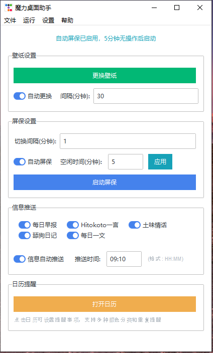

# 魔力桌面助手 v2.0

一个功能丰富的桌面工具，集成了壁纸管理、屏保功能、信息推送和智能日历提醒系统。


## 🎯 主要功能

### 💻 壁纸与屏保
- **智能壁纸更换**：自动下载并设置高质量桌面壁纸
- **屏保模式**：定时切换精美图片作为屏保
- **图片管理**：本地图片缓存和管理系统

### 📅 日历提醒系统
- **智能提醒**：支持设置不同时间的提醒事项
- **重复选项**：每天、每周、每月、每年重复提醒
- **颜色标记**：为不同提醒设置个性化颜色
- **年份范围**：支持1975-2075年的广泛年份选择
- **桌面通知**：到时间弹出美观的桌面提醒窗口
- **详情查看**：通知窗口支持查看和编辑提醒详情

### 📰 信息推送
- **每日资讯**：新闻、天气、热搜等信息推送
- **API集成**：支持多种第三方API服务
- **定时推送**：可配置的信息推送时间

### 🔧 系统功能
- **系统托盘**：最小化到系统托盘运行
- **单实例运行**：防止重复启动，重复运行会激活已有窗口
- **数据持久化**：所有设置和提醒数据自动保存

## 🚀 快速开始

### 环境要求
- Windows 10/11
- Python 3.8+ （如果从源码运行）

### 安装依赖
```bash
pip install -r requirements.txt
```

### 运行程序
```bash
python main.py
```

## 📦 打包为可执行文件

项目包含了完整的打包脚本，可以将程序打包为独立的exe文件：

```bash
python build_exe.py
```

打包后的文件将生成在 `dist/` 目录中，包含：
- `魔力桌面助手.exe` - 主程序文件
- `启动程序.bat` - 便捷启动脚本
- `使用说明.txt` - 详细使用说明

## 📋 项目结构

```
desk-wallpapers/
├── main.py                     # 主程序入口
├── calendar_reminder.py        # 日历提醒模块
├── reminder_notification.py    # 提醒通知模块
├── daily_news.py              # 每日资讯模块
├── integrated_features.py     # 集成功能模块
├── alapi_services.py          # API服务模块
├── app_icon.ico               # 应用图标
├── requirements.txt           # 依赖列表
├── build_exe.py              # 打包脚本
└── README.md                 # 项目说明
```

## 💡 功能特色

### 日历提醒亮点
- **直观界面**：清晰的月历视图，一目了然
- **灵活重复**：支持多种重复模式，满足不同需求
- **视觉提示**：有提醒的日期显示红色圆点标记
- **智能通知**：美观的桌面通知窗口，支持重复类型显示
- **快速导航**：年份和月份下拉选择，快速跳转任意日期

### 技术特性
- **现代UI**：基于ttkbootstrap的现代化界面设计
- **线程安全**：后台任务不影响界面响应
- **异常处理**：完善的错误处理和恢复机制
- **模块化设计**：清晰的代码结构，易于维护和扩展

## 🎨 界面预览

### 主界面
- 壁纸设置区域
- 屏保配置选项
- 信息推送设置
- 日历提醒入口

### 日历界面
- 月历视图显示
- 年份月份下拉选择
- 提醒事项列表
- 添加/编辑提醒功能

### 提醒通知
- 美观的弹窗设计
- 重复类型显示
- 查看详情按钮
- 确认操作按钮

## ⚙️ 配置说明

### API配置
程序支持多种API服务，可在设置中配置相应的Token：
- 天气API
- 新闻API
- 其他第三方服务

### 数据存储
- 配置文件自动保存在用户目录
- 提醒数据使用JSON格式存储
- 支持数据导入导出

## 🔄 版本历史

### v2.0 (最新)
- ✨ 新增完整的日历提醒系统
- 🎨 优化界面设计和用户体验
- 📅 支持年份月份下拉选择
- 🔄 增加"每年"重复选项
- 🎯 改进提醒通知窗口
- 🐛 修复多项用户反馈的问题
- 📦 支持一键打包为exe文件

### v1.x
- 基础壁纸和屏保功能
- 信息推送系统
- 系统托盘支持

## 🤝 贡献指南

欢迎提交Issue和Pull Request！

### 开发环境搭建
1. Fork本仓库
2. 创建开发分支
3. 安装依赖：`pip install -r requirements.txt`
4. 进行开发和测试
5. 提交Pull Request

### 代码规范
- 使用中文注释和文档字符串
- 遵循PEP 8代码风格
- 添加适当的错误处理
- 编写单元测试（如适用）

## 📄 许可证

本项目采用MIT许可证 - 查看 [LICENSE](LICENSE) 文件了解详情

## 🙏 致谢

- [ttkbootstrap](https://github.com/israel-dryer/ttkbootstrap) - 现代化的tkinter主题
- [Pillow](https://github.com/python-pillow/Pillow) - Python图像处理库
- [requests](https://github.com/psf/requests) - HTTP库
- [pystray](https://github.com/moses-palmer/pystray) - 系统托盘库
- [PyInstaller](https://github.com/pyinstaller/pyinstaller) - Python应用打包工具

## 📞 支持

如果您在使用过程中遇到问题，请：
1. 查看使用说明文档
2. 在GitHub上提交Issue
3. 检查是否有相关的解决方案

---

**感谢使用魔力桌面助手！** 🎉

如果这个项目对您有帮助，请给我们一个⭐️
